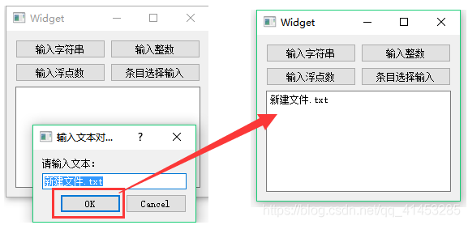
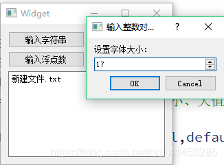
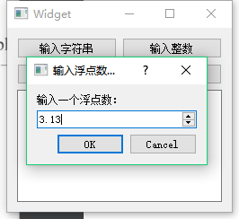
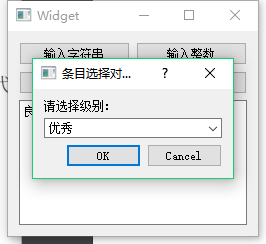

# Qt笔记
## 基本类
### QInputDialog标准输入对话框
**一、标准输入对话框的分类**
QInputDialog有多种输入方式，下面介绍几种常用的
* ①单行字符串输入
* ②整数输入
* ③浮点数输入
* ④列表框选择输入
* ⑤多行文本
**二、单行字符串输入对话框（getText函数）**
>**getText()函数：**
>* 用于显示一个用于输入字符串的文本编辑框
>* 参数：1.父窗口指针 2.QInputDialog的标题 3.QInputDialog内部显示的文本 4.文本编辑框内容的显示方式 5.文本编辑框默认显示内容 6.一个标志，用来判断getText函数是否正常返回
>* 返回值：返回文本编辑框内的字符串
```c
void Widget::on_btnInputString_clicked()
{
    QString dlgTitle=QStringLiteral("输入文本对话框");//对话框标题
    QString txtLabel=QStringLiteral("请输入文本：");//对话框Label显示内容
    QString defaultInput=QStringLiteral("新建文件.txt");//对话框内输入框的默认内容
    QLineEdit::EchoMode echoMode=QLineEdit::Normal;//输入框的文本内容为正常显示
    //QLineEdit::EchoMode echoMode=QLineEdit::Password;//输入框的文本内容为密码方式显示
    bool ok=false;
    QString text=QInputDialog::getText(this,dlgTitle,txtLabel,echoMode,defaultInput,&ok);
    if(ok && !text.isEmpty())
        ui->plainTextEdit->appendPlainText(text);
}
```


**三、整数输入对话框（getInt函数）**
>getInt函数：
>+ 用于显示一个用于输入整数的编辑框，显示的是Spin Box控件
>+ 参数：1.父窗口指针 2.QInputDialog的标题 3.QInputDialog内部显示的文本 4.Spin Box控件默认值 5.Spin Box控件最小值 6.Spin Box控件最大值 7.Spin Box控件单步值 8.一个标志，用来判断getInt函数是否正常返回
>+ 返回值：返回Spin Box控件的整数值
```c
void Widget::on_btnInputInt_clicked()
{
    QString dlgTitle=QStringLiteral("输入整数对话框");//对话框标题
    QString txtLabel=QStringLiteral("设置字体大小：");//对话框Label显示内容
    int defaultValue=ui->plainTextEdit->font().pointSize(); //得到plainTextEdit控件的字体大小
    int minValue=6,maxValue=50,stepValue=1; //设置整数编辑框的最小、大值，与单步改变值
    bool ok=false;
    int inputValue=QInputDialog::getInt(this,dlgTitle,txtLabel,defaultValue,minValue,maxValue,stepValue,&ok);
    if(ok){
        QFont font=ui->plainTextEdit->font();
        font.setPointSize(inputValue);
        ui->plainTextEdit->setFont(font);
    }
}
```


**四、浮点数输入对话框（getDouble函数）**
>getDouble函数：
>+ 用于显示一个用于输入浮点数的编辑框，显示的是Double SpinBox控件
>+ 参数：1.父窗口指针 2.QInputDialog的标题 3.QInputDialog内部显示的文本 4.Spin Box控件默认值 5.Spin Box控件最小值 6.Spin Box控件最大值 7.Spin Box控件显示的小数点位数控制 8.一个标志，用来判断getDouble函数是否正常返回
>+ 返回值：返回Double SpinBox控件的浮点值
```c
void Widget::on_btnInputFloat_clicked()
{
    QString dlgTitle=QStringLiteral("输入浮点数对话框");//对话框标题
    QString txtLabel=QStringLiteral("输入一个浮点数：");//对话框Label显示内容
    float defaultValue=3.13;//默认值
    float minValue=0,maxValue=10000;//最小、大值
    int decimals=2;//小数点后几位
    bool ok=false;
    float inputValue=QInputDialog::getDouble(this,dlgTitle,txtLabel,defaultValue,minValue,maxValue,decimals,&ok);
    if(ok){
        QString str=QString::asprintf("input a number：%.2f",inputValue);
        ui->plainTextEdit->appendPlainText(str);
    }
}
```


**五、下拉列表选择输入对话框（getItem函数）**
>getItem函数：
>+ 用于显示一个ComboBox组件
>+ 参数：1.父窗口指针 2.QInputDialog的标题 3.QInputDialog内部显示的文本 4.ComboBox组件的内容列表 5.默认显示ComboBox组件哪一个索引的内容 6.ComboBox组件是否可被编辑7.一个标志，用来判断getItem函数是否正常返回
>+ 返回值：返回从ComboBox组件选择的内容
```c
void Widget::on_btnInputItem_clicked()
{
    QStringList items;//ComboBox控件的内容
    items<<QStringLiteral("优秀")<<QStringLiteral("良好")<<QStringLiteral("及格")<<QStringLiteral("不及格");
    QString dlgTitle=QStringLiteral("条目选择对话框");//对话框标题
    QString txtLabel=QStringLiteral("请选择级别：");//对话框Label显示内容
    int curIndex=0;//ComboBox控件默认哪个索引的内容
    bool editable=true;//ComboBox控件内容是否可被编辑
    bool ok=false;
    QString text=QInputDialog::getItem(this,dlgTitle,txtLabel,items,curIndex,editable,&ok);
    if(ok && !text.isEmpty())
        ui->plainTextEdit->appendPlainText(text);
}
```



### QString的基本使用
+ 类似于c中的printf的使用
```c++
QString("%1").arg(1)
```
会输出如下：
`1`
## QtDeBug
1. 设断点
2. debug
3. f10单点调试