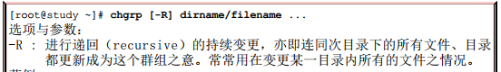
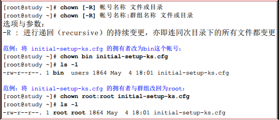
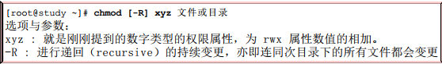

# 笔记
## 使用
1. libxxx: 一般程序会链接到.so库文件，.so 库文件是.so.0.x文件的软链接
2. telnet +ip +port 查看某个端口是否可以访问
3. pkill SECDY：杀掉客户端程序

## 学习笔记
### 1.Linux文件权限与目录配置
#### （1）更改权限命令
   * chgrp ： 改变文件所属群组
        
        
   * chown ： 改变文件拥有者
        
        
   * chmod ： 改变文件的权限, SUID, SGID, SBIT等等的特性
       >  Linux文件的基本权限就有九个，分别是owner/group/others三种身份各有自己的r/w/x权限，其中，我们可以使用数字来代表各个权限，各个权限的分数对照表如下：
       >> | 权限    |分数     |
       >> | --- | --- |
       >> |   r  |  4   |
       >> |  w   |  2  |
       >> |  x   |  1  |
        
      >每种身份（owner/group/others）各自的三个权限（r/w/x）分数是需要累加的，例如当权限为：[-rwxrwx---]分数则是：
      >>owner = rwx = 4+2+1 =7
      >>group = rwx = 4+2+1 = 7
      >>others = --- = 0+0+0 = 0

        