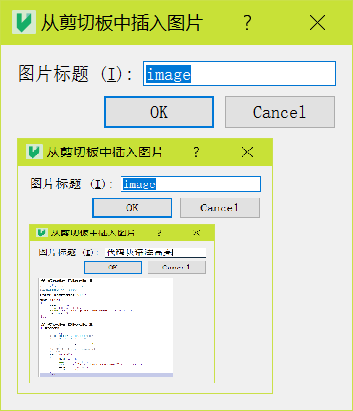

# MarkDown使用
# 一级标题
## 二级标题

## MarkDown段落格式
*斜体*
**粗体**
__粗体__
***斜粗体***
___斜粗体___
~~删除线~~
<u>下划线</u>

## MarkDown列表
* 无序列表
+ 无序列表
- 无序列表
1. 有序列表
    * 嵌套列表
    * 空四个空格
    - 即可

## MarkDown区块
> 区块引用
> 区块引用
>>二级嵌套
>>>三级嵌套
>+ 区块中使用列表
>- 区块中使用列表
>* 区块中使用列表

+ 列表中
    >使用区块
    >可嵌套

## MarkDown代码
如果是段落上的一个函数或者是片段的代码可以用反引号括起来
`printf() `函数

**代码区块**
使用四个空格或一个制表符tab
```c
int main()
    {
    int a = 10;
    printf("a = %d\n", a);
    return 0;
    }
```

## MarkDown链接
这是一个链接[菜鸟教程](https://www.runoob.com/markdown/md-link.html)

或者直接使用链接<https://www.runoob.com/markdown/md-link.html>

**高级链接**
通过变量来设置一个链接，变量赋值在文档末尾进行：

这个链接1作为网址变量[Google][1]
这个链接用 runoob 作为网址变量   [Runoob][runoob]
然后在文档结尾为变量赋值（网址）

[1]:https://www.runoob.com/markdown/md-link.html
[runoob]:https://www.runoob.com/markdown/md-link.html

## MarkDown图片

