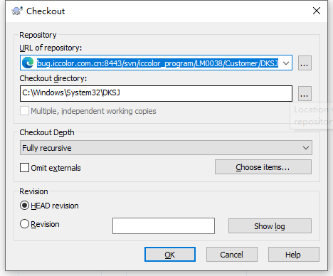

# svn使用
## 服务
1. 找到要下载的文件
2. 右键——checkout

3. 在第二个框里选择本地文件夹作为导出目录

## 本地
### 提交
1. 右键要提交的文件或文件夹——TortoiseSVN——Add——选择要提交的——ok
2. 在文件夹所在目录右键——SVN commi——选择文件——Message中添加说明
3. **提交：提交前注意是修改的最新文件**

### 检查
1. 右键修改后要检查的文件——TortoiseSVN——check for Modifications——双击文件名
2. 可以查看修改前与修改后的不同
3. 若放弃修改可右键原代码——use this text block